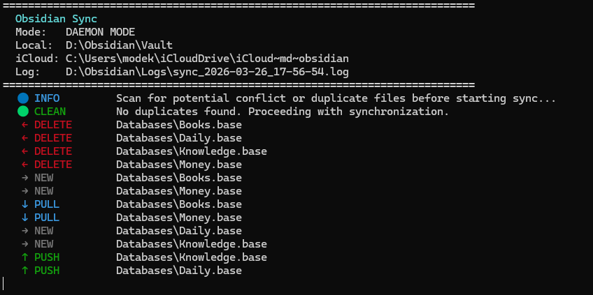

# Obsidian iCloud Windows Sync

A highly optimized, asynchronous, three-way sync engine designed to solve the notorious issues between Obsidian, iCloud Drive, and Windows.



## Installation & Setup

1. Clone the repository.
2. Install the required Python packages:
   ```bash
   pip install -r requirements.txt
   ```
3. Open `sync.py` and modify the `CONFIG` section with your actual paths:
   ```python
   LOCAL_VAULT = r"C:\Obsidian\Vault"
   ICLOUD_VAULT = r"C:\Users\user\iCloudDrive\iCloud~md~obsidian"
   HISTORY_DIR = r"C:\Obsidian\History"
   LOGS_DIR = r"C:\Obsidian\Logs"
   ```
4. You can run the script using standard Python.
   ```bash
   python sync.py
   ```

> Run natively on Windows, not WSL — iCloud placeholders behave incorrectly under WSL.

### Modes of Operation

| Mode | Config | Behavior |
|---|---|---|
| **One-Shot** | `RUN_CONTINUOUSLY = False` | Single full pass, then exits. Use with Task Scheduler. |
| **Daemon** | `RUN_CONTINUOUSLY = True` | Runs continuously, polling every `POLL_INTERVAL` seconds. |

#### Autostart via Task Scheduler

Create `run-sync.ps1`:
```powershell
& py "$PSScriptRoot\sync.py"
```

In `taskschd.msc` → Create Task:
- **Triggers**: At log on, delay 1 minute
- **Actions**: `C:\Windows\System32\conhost.exe` with arguments:
   `--headless powershell.exe -WindowStyle Hidden -NoProfile -NonInteractive -file "C:\PATH\TO\run-sync.ps1"`
- **Settings**: Restart on failure every 1 minute, up to 99 times

---

## How It Works

Three locations are tracked per file:
- **L** = Local vault (`LOCAL_VAULT`)
- **C** = iCloud copy (`ICLOUD_VAULT`)
- **H** = History snapshot (`HISTORY_DIR`) — last known good state

Each sync pass walks the union of all three directories and applies these rules:

| State | Action |
|---|---|
| `L` only | New local file → stabilize → push to `C`, seed `H` |
| `C` only | New remote file → stabilize → restore to `L`, seed `H` |
| `L == C == H` | Nothing to do |
| `L != H`, `C == H` | Local changed → push `L` → `C`, update `H` |
| `C != H`, `L == H` | Remote changed → restore `L` from `C`, update `H` |
| `L != H`, `C != H` | Conflict → stabilize → pick newer by mtime, backup loser as `_CONFLICT_TIMESTAMP` |
| `L` missing, `C == H` | Confirmed local delete → remove `C` and `H` |
| `L` missing, `C != H` | Remote changed → restore `L` from `C` |
| `C` missing, `L == H` | Confirmed remote delete → remove `L` and `H` |
| `C` missing, `L != H` | Local changed → push `L` → `C` |
| `L` and `C` missing | Remove orphaned `H` |

### Key Protections

- **Stabilization** (`STABILITY_WINDOW`): waits before acting on creates/deletes to avoid reacting to mid-save or rename workflows
- **Conflict wait** (`STABILIZE_WAIT`): longer wait on both-changed scenarios to detect still-active edits
- **Cooldowns**: skips recently synced files to prevent autosave thrash; longer for large files (`BIG_FILE_COOLDOWN`)
- **Atomic writes**: write to `.tmp` then `os.replace()`, with retries and Win32 `MoveFileEx` fallback
- **Conflict duplicates**: losing side saved as `filename_CONFLICT_TIMESTAMP.ext` before overwrite

---

## Tuning

| Setting | Default | Notes |
|---|---|---|
| `STABILITY_WINDOW` | `3s` | Increase for slow disks or large files |
| `STABILIZE_WAIT` | `8s` | Increase if you edit very slowly |
| `COOLDOWN_SECONDS` | `3s` | Increase if autosave causes loops |
| `BIG_FILE_THRESHOLD` | `100KB` | Files above this get `BIG_FILE_COOLDOWN` |
| `IGNORE_PATTERNS` | see config | Exclude folders like `.obsidian/cache` |